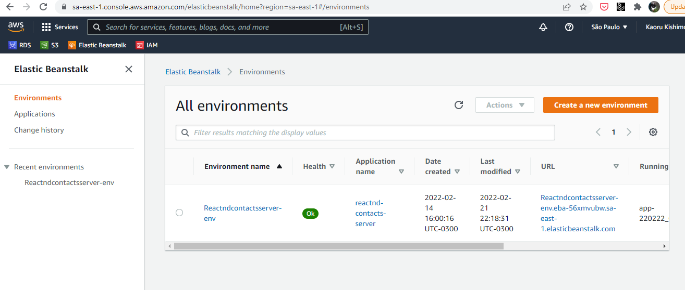
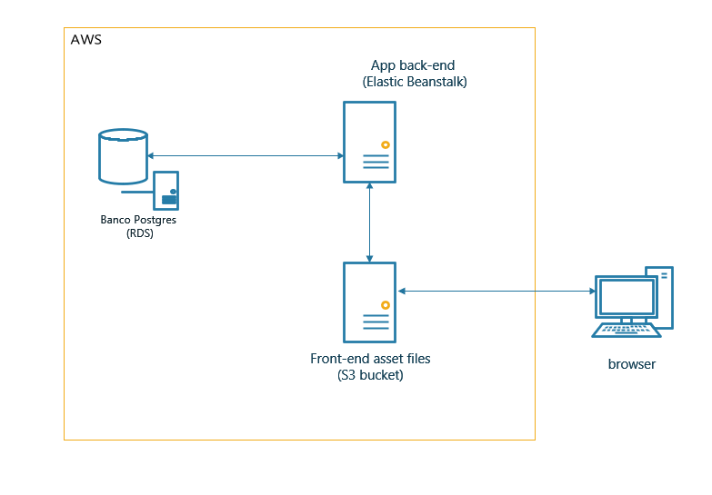

# Hosting a Full-Stack Application

# Udagram

The provided Udagram app is deployed at:

http://elasticbeanstalk-sa-east-1-299879235544.s3-website-sa-east-1.amazonaws.com/

## Screenshots of last build in CircleCi

## Environment variables in CircleCi

## Screenshots of the configuration page of your AWS services

##  Overview of the infrastructure and the pipeline

## License

[License](LICENSE.txt)
